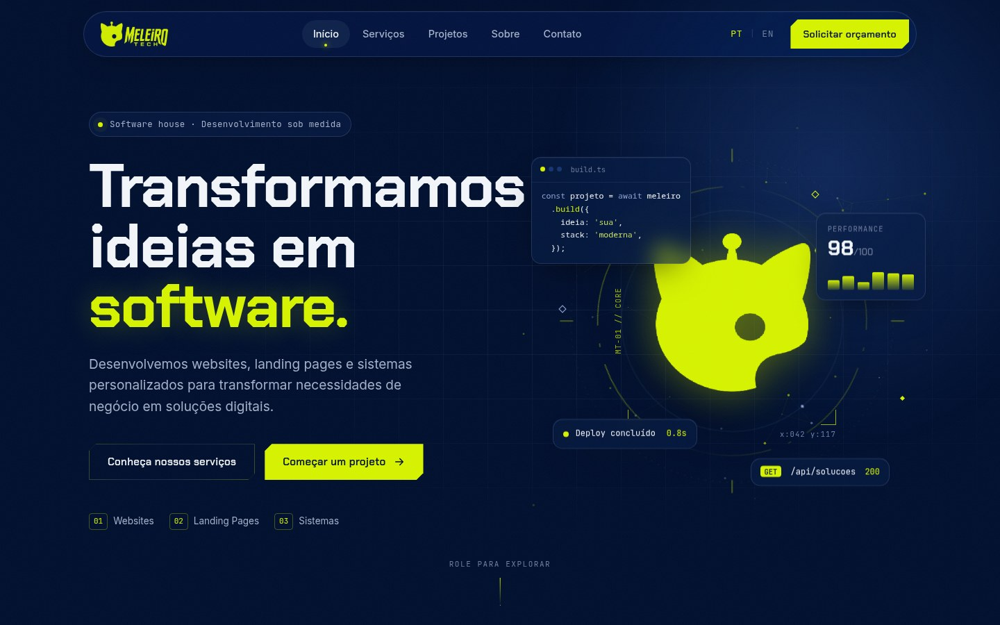
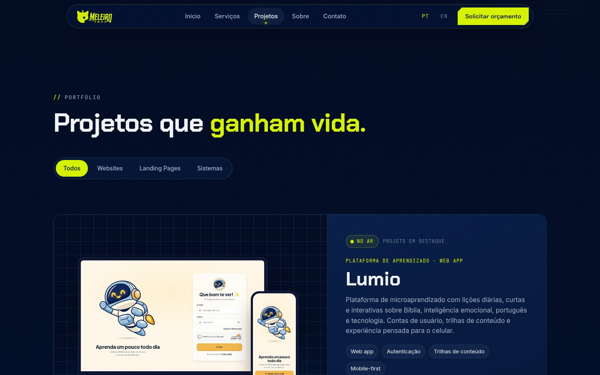
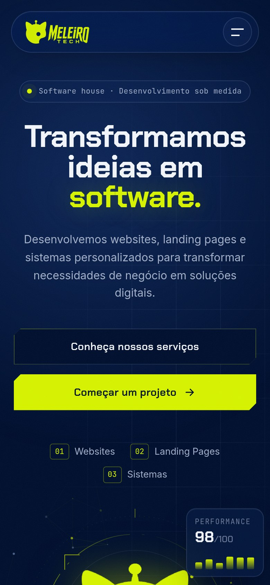

<div align="center">


### Transformamos ideias em software.

Site institucional da **Meleiro Tech** — websites, landing pages e sistemas personalizados.

[**meleiro.tech**](https://meleiro.tech) · [Instagram](https://instagram.com/meleiro.tech) · [WhatsApp](https://wa.me/5583993041956)

</div>

<br />



<table>
  <tr>
    <td width="70%"></td>
    <td width="30%"></td>
  </tr>
</table>

## Destaques

- **Bilíngue** — PT-BR (padrão) e EN-US com troca instantânea e preferência salva no navegador.
- **Zero dependências** — HTML, CSS e JavaScript puros (ES Modules), sem etapa de build.
- **Formulário funcional** — envio para o e-mail via [FormSubmit](https://formsubmit.co) e alternativa de envio pelo WhatsApp com a mensagem já preenchida.
- **Animações com propósito** — reveal on scroll, parallax, partículas e constelação de tecnologias, todas respeitando `prefers-reduced-motion`.
- **Responsivo** — layouts dedicados para desktop, tablet e celular.
- **SEO e compartilhamento** — metadados Open Graph, `sitemap.xml` e `robots.txt`.

## Estrutura

```text
.
├── index.html                 # Página única com todas as seções
├── assets/
│   ├── css/
│   │   ├── base.css           # Tokens da marca, reset e utilitários
│   │   ├── components.css     # Botões, toast e peças reutilizáveis
│   │   ├── layout.css         # Header, navegação, seções e footer
│   │   ├── sections/          # Um arquivo por seção da página
│   │   └── animations.css     # Reveal, keyframes e reduced motion (carregar por último)
│   ├── js/
│   │   ├── main.js            # Ponto de entrada
│   │   ├── config.js          # Contatos, endpoint do formulário e idioma padrão
│   │   ├── core/              # DOM helpers, i18n, scroll e toast
│   │   ├── modules/           # Um módulo por funcionalidade da página
│   │   └── locales/           # Textos em pt e en
│   └── img/                   # Imagens otimizadas para a web
├── brand/                     # Arquivos originais da identidade visual
└── docs/                      # Imagens usadas neste README
```

## Rodando localmente

Por usar ES Modules, o site precisa ser servido por HTTP (abrir o `index.html` direto no navegador não funciona).

```bash
npm run dev
# ou
python3 -m http.server 5173
```

Acesse <http://localhost:5173>.

## Configuração

Os dados de contato ficam centralizados em [`assets/js/config.js`](assets/js/config.js):

```js
export const CONTACT = { email: "meleiro.tech@gmail.com", whatsapp: "5583993041956" };
```

Os textos do site ficam em [`assets/js/locales/`](assets/js/locales). Para editar um texto, altere a mesma chave em `pt.js` e `en.js`.

## Padrões de código

```bash
npm run format        # formata CSS, JS, JSON e Markdown com Prettier
npm run format:check  # verifica a formatação
```

As convenções de editor estão em [`.editorconfig`](.editorconfig).

## Deploy

Publicado automaticamente pelo **GitHub Pages** a partir da branch `main`, com domínio personalizado definido em [`CNAME`](CNAME) e HTTPS obrigatório.

## Identidade visual

| Token | Cor       |
| ----- | --------- |
| Navy  | `#01102F` |
| Lime  | `#D7F300` |

Tipografia: **Chakra Petch** (títulos), **Inter** (texto) e **JetBrains Mono** (detalhes técnicos).

---

<div align="center">
  <sub>© Meleiro Tech. Todos os direitos reservados.</sub>
</div>
